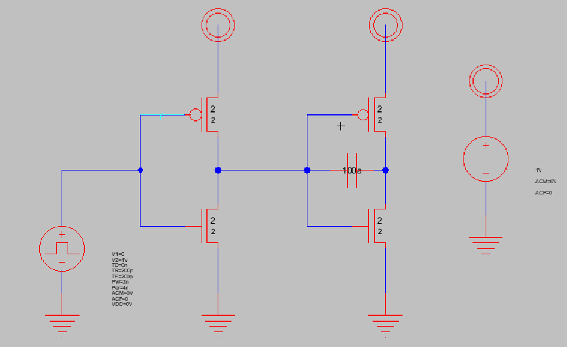
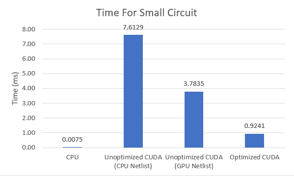
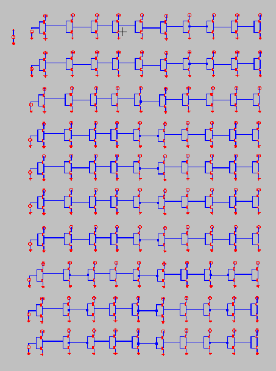
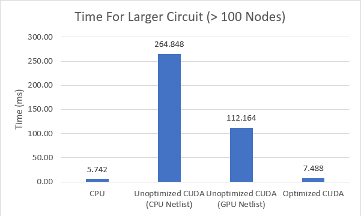
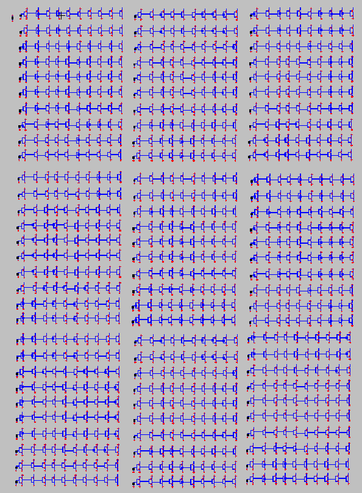
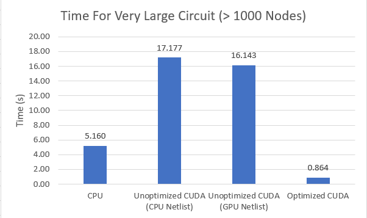

CUDA SPICE Circuit Simulator
======================
**University of Pennsylvania, CIS 565: GPU Programming and Architecture**

* Angelina Risi
  * [LinkedIn](www.linkedin.com/in/angelina-risi)
  * [Twitter](https://twitter.com/Angelina_Risi)
* Tested on: Windows 10, i7-6700HQ @ 2.60GHz 8GB, GTX 960M 4096MB (Personal Laptop)

## GUI
  

  
The simulator has a simple GUI to enhance user-friendliness. The user can open a SPICE netlist file, loading the contents into the program. The output .csv file name and path should be typed into the Output File textbox to save the simulation data. For a DC sweep, the name of the swept element is typed into the name box and the start, stop and step values into their respective boxes. Transient sweeps use the same boxes for the timeframe and step info, so in most cases they cannot be preformed at the same time.
You press start to perform the simulation and write to the file.

### Input Data
  
The simulator requires a SPICE netlist as input. This can be any file using the SPICE format to describe circuit elements and their connections and values. The simulator uses "gnd" as the hard-coded ground node name, also hard-code aliased as "0" if your netlist generator uses numbers instead. The parser currently does NOT support subcircuits, .global, and any simulation commands.  
Currently the simulator only supports the following elements: resistors, DC and Pulse voltage sources, current sources, VCCS's, capacitors, and MOSFETs with model files.  
  
### Operating Point Simulation
  
The OP simulation solves the circuit for the default DC parameters specified in the netlist. The output is a single row of solved voltage data for each node in the circuit.
  
  
### DC Sweep Simulation
  
This simulation sweeps the first parameter of the named element over the range and steps specified. This means the DC voltage for voltage sources. The output is the node voltages for each parameter step, allowing one to generate DC Voltage transfer characteristics for their circuits.  
  
### Transient Simulation
  
The transient simulation sweeps the circuit over time. This is where the pulse voltage sources and capacitors, as time-dependent elements, factor in. Additionally, the transistor parasitic capacitances become important here. The output is the node voltages for each timestep, useful for clocked or time-varying circuits.
  
  
  
## Performance Analysis
  
The performance was characterized for the OP simulation, the basic building block of the other simulation types. Performance was compared between the intermediary steps in optimizing the CUDA solver. Here are compared the CPU version, the unoptimized CPU netlist version, the unoptimized GPU netlist version, and the fully optimized with GPU netlist version. The "optimized" code minimizes memory copying between CPU and GPU and performs matrix population on the GPU.  
The runtime of each method was measured using the steady clock, with all the output except for memory copies commented out to not include write time.  
  
  
  
  
  
  

  
 
  
   
  
  

From these performance tests, as expected larger circuits benefit the most from parallelization. Unfortunately the non-linear convergence algorithm requires serial guesses, but I can imagine some optimization possible if a first guess pass using multiple start guesses were done in parallel streams and the closest used for convergence.  
In the DC Sweep and Transient cases, the time to complete the analysis is proportional to the number of steps times the time for a OP simulation. In a large circuit requiring thousands of timesteps of simulation, the faster CUDA simulation could save a lot of time.
  
  
  
  