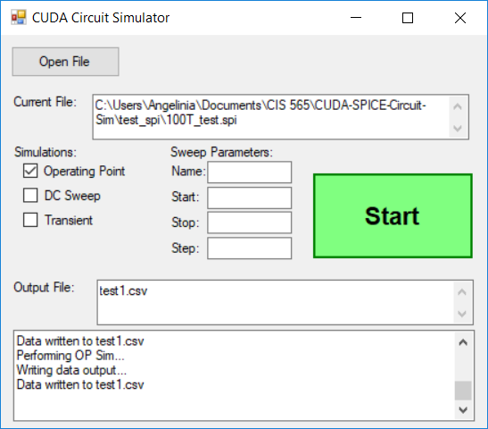

CUDA SPICE Circuit Simulator
======================
**University of Pennsylvania, CIS 565: GPU Programming and Architecture**

* Angelina Risi
  * [LinkedIn](www.linkedin.com/in/angelina-risi)
  * [Twitter](https://twitter.com/Angelina_Risi)
* Tested on: Windows 10, i7-6700HQ @ 2.60GHz 8GB, GTX 960M 4096MB (Personal Laptop)

# GUI
  

  
The simulator has a simple GUI to enhance user-friendliness. The user can open a SPICE netlist file, loading the contents into the program. The output .csv file name and path should be typed into the Output File textbox to save the simulation data. For a DC sweep, the name of the swept element is typed into the name box and the start, stop and step values into their respective boxes. Transient sweeps use the same boxes for the timeframe and step info, so in most cases they cannot be preformed at the same time.
You press start to perform the simulation and write to the file.

## Input Data
  
The simulator requires a SPICE netlist as input. This can be any file using the SPICE format to describe circuit elements and their connections and values. The simulator uses "gnd" as the hard-coded ground node name, also hard-code aliased as "0" if your netlist generator uses numbers instead. The parser currently does NOT support subcircuits, .global, and any simulation commands.  
Currently the simulator only supports the following elements: resistors, DC and Pulse voltage sources, current sources, VCCS's, capacitors, and MOSFETs with model files.  
  
## Operating Point Simulation
  
The OP simulation solves the circuit for the default DC parameters specified in the netlist. The output is a single row of solved voltage data for each node in the circuit.
  
  
  